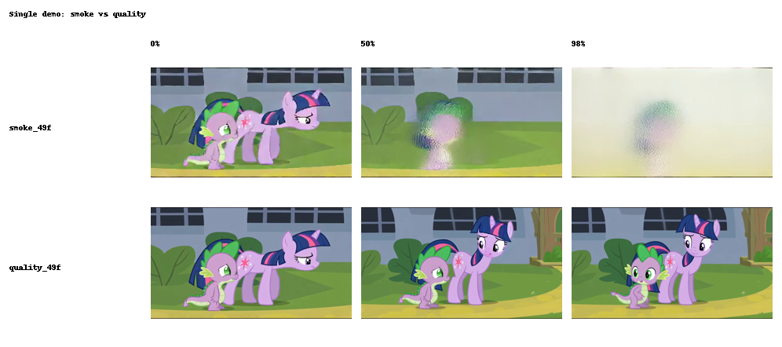
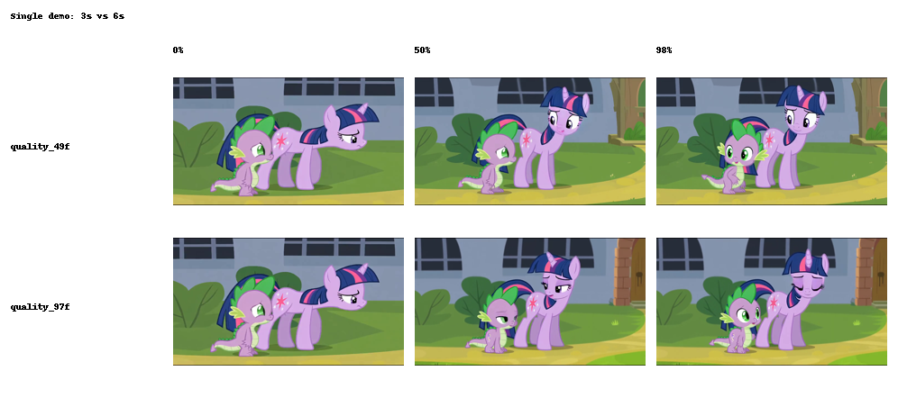
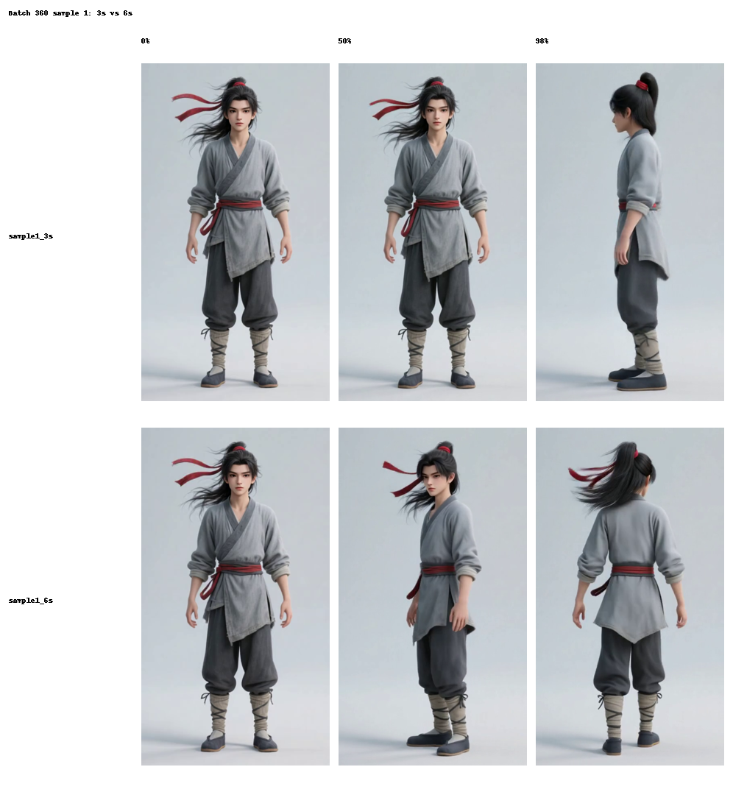
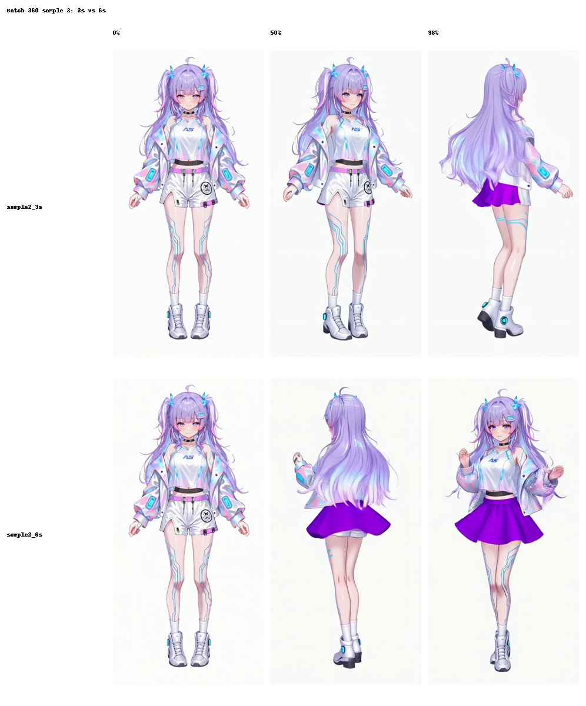
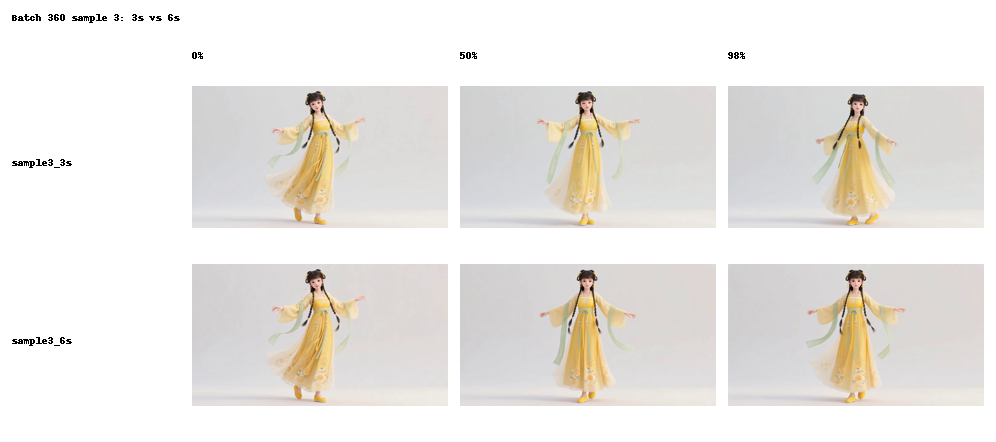

# AniSora Benchmark Report

## Scope

This report summarizes the benchmark artifacts collected from the AniSora Linux adaptation project in this repository.

Benchmark inputs included:

- 1 single-image demo input
- 3 batch prompts from `data/inference_360.txt`
- 3 inference settings:
  - smoke: `320p / 1 step / 49 frames`
  - quality: `832x480 / 4 steps / 49 frames`
  - longer quality: `832x480 / 4 steps / 97 frames`

Artifacts used in this report:

- benchmark manifest: `results/benchmark_manifest.json`
- benchmark table: `results/benchmark.csv`
- generated summary: `results/benchmark_summary.md`
- batch prompts: `data/inference_360.txt`

## Single-demo comparisons

### Smoke vs quality

Observation:

- the `480p / 4 steps` setup clearly improves edge sharpness, clothing texture, and character structure over the smoke baseline

### 3s vs 6s

Observation:

- extending the same sample from `49` to `97` frames improves motion completeness
- the 6s result also makes later-frame drift easier to observe

## Batch `inference_360` comparisons

### Sample 1: 3s vs 6s

Observation:

- sample 1 remains relatively stable after extending to 6s
- the longer version improves rotation completeness without severe late-frame breakage

### Sample 2: 3s vs 6s

Observation:

- sample 2 benefits from the longer sequence in terms of motion completeness
- however, this sample shows the most obvious late-frame appearance drift among the three batch examples

### Sample 3: 3s vs 6s

Observation:

- sample 3 is comparatively stable in the 6s setting
- dress silhouette and overall pose remain more coherent than in sample 2

## Summary findings

### Quality trade-off

- moving from the smoke baseline to `480p / 4 steps` gives the clearest quality improvement across both single-demo and batch settings
- the improvement is most visible in character contours, texture richness, and silhouette stability

### Duration trade-off

- moving from `49` frames to `97` frames improves action completeness
- the cost is higher VRAM usage and a greater chance of later-frame drift

### Resource trade-off

- the `97-frame` setting was the heaviest tested setup in this project
- during the original experiment, VRAM for the 6s setting was observed around `17GB - 18GB` on RTX 4090

## Reproduction notes

For reruns or extension experiments, the most relevant files are:

- `scripts/run_single.py`
- `scripts/run_batch.py`
- `scripts/extract_compare_frames.py`
- `scripts/build_benchmark.py`
- `docs/linux_compatibility.md`

## Suggested next experiments

- add multi-seed benchmarking for the same prompt and input image
- test prompt templates with different motion specificity
- compare more frame counts between `49` and `97`
- add automated temporal-consistency scoring or frame-difference diagnostics
